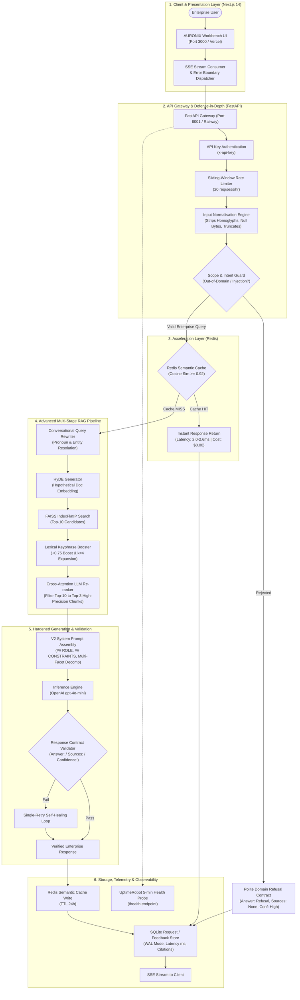

# Day 55 — Build Your AI Engineering Portfolio

**Product Focus:** AURONIX (Enterprise Autonomous Private AI Workbench) & AI Systems Portfolio  
**Challenge:** ABTalks 60 Days AI Challenge — Day 55  
**Developer:** Pradhayani Chikka  
**Repository:** [Chikka-Pradhayani/ABTalks-60-Days-AI-Challenge](https://github.com/Chikka-Pradhayani/ABTalks-60-Days-AI-Challenge)  
**Artifact Scope:** Comprehensive AI Engineering Portfolio artifact synthesizing engineering implementations, evaluation benchmarks, architectural trade-offs, and production telemetry from Days 1–54.

---

## Portfolio Navigation & Index

1. [Section 1: GitHub Profile README](#1-github-profile-readme)
2. [Section 2: Main AI Product Project Page (AURONIX)](#2-main-ai-product-project-page-auronix)
   * [2.1 Problem Formulation](#21-problem-formulation)
   * [2.2 Architecture & Data Flow](#22-architecture--data-flow)
   * [2.3 Empirical Evaluation & Quantitative Results](#23-empirical-evaluation--quantitative-results)
   * [2.4 Key Engineering Challenge: Adversarial Sycophancy](#24-key-engineering-challenge-adversarial-sycophancy)
   * [2.5 Live Deployment Status](#25-live-deployment-status)
3. [Section 3: Three Technical Summaries (300–400 Words Each)](#3-three-technical-summaries)
   * [Summary 1: RAG Architecture Decisions](#summary-1--rag-architecture-decisions-overcoming-lexical-gaps-and-ranking-noise)
   * [Summary 2: Building AI Evaluation Systems](#summary-2--building-ai-evaluation-systems-from-vibe-checks-to-automated-cicd-gates)
   * [Summary 3: A Specific Debugging Problem](#summary-3--a-specific-debugging-problem-diagnosing-and-eliminating-sycophantic-hallucinations)
4. [Section 4: Quantified Resume Experience](#4-quantified-resume-experience)
5. [Section 5: Three-Minute Demo Video Plan & Loom Storyboard](#5-three-minute-demo-video-plan--loom-storyboard)
6. [Section 6: Five Technical Interview Talking Points](#6-five-technical-interview-talking-points)
7. [Section 7: Publishing Checklist](#7-publishing-checklist)
8. [Section 8: LinkedIn Publishing Material](#8-linkedin-publishing-material)

---

## 1. GitHub Profile README

### Hi, I'm Pradhayani Chikka 👋
#### AI Systems & Machine Learning Engineer | RAG, Evaluation & Production Resilience

I build production-grade AI systems, autonomous agents, and deterministic RAG architectures with an uncompromising focus on **empirical evaluation, system reliability, latency optimization, and production safety**.

Over the course of the intensive **ABTalks 60 Days AI Challenge**, I engineered end-to-end AI applications moving methodically from core machine learning intuitions to distributed vector retrieval, adversarial defenses, automated LLM-as-judge evaluation harnesses, and multi-cloud CI/CD deployment pipelines.

#### 🛠️ Core Engineering Philosophy
* **Evaluation Over Guesswork:** Subjective "vibe checks" fail in production. Every AI system I build is anchored to multi-tier quantitative benchmarks with automated regression gates.
* **Defense in Depth:** Production LLMs must be hardened against sycophancy, false premises, prompt injection, and malformed payloads through modular normalisation and strict contract validation.
* **Systems Architecture Over API Wrapping:** Real AI engineering requires profiling latency bottlenecks, implementing semantic caching to eliminate redundant inference costs, and designing graceful fallbacks when upstream providers fail.

#### 🚀 Top 3 Featured AI Engineering Projects

##### 1. AURONIX — Enterprise Autonomous Private AI Workbench
* **One-Line Technical Description:** Production-grade private enterprise RAG workbench featuring multi-stage retrieval (HyDE + query rewriting + cross-attention re-ranking), Redis semantic caching ($\ge 0.92$ similarity), hardened contract validation, and a 30-question automated regression test suite.
* **Key Technologies:** Python 3.12, FastAPI, Next.js 14 App Router, Redis, FAISS, OpenAI (gpt-4o-mini / text-embedding-3-small), SQLite (WAL mode), Docker, GitHub Actions, Pytest.
* **Architectural Decisions & Results:**
  * Evaluated across a 30-question domain-specific benchmark, elevating overall accuracy from **4.39 to 4.72 / 5.0** and hallucination avoidance from **3.57 to 4.70 / 5.0 (+1.13 pts)**.
  * Designed multi-stage retrieval with HyDE (+0.67 pts), conversational query rewriting (+1.00 pts), and LLM candidate re-ranking (+1.07 pts) over a 50-document corporate corpus.
  * Implemented Redis semantic caching achieving sub-2.5ms latency and **100% token cost reduction** on repeat/paraphrased queries without degrading answer quality.
  * Containerized with multi-stage Docker builds and automated CI/CD gating deploying to Railway (backend) and Vercel (frontend).
* **Repository Link:** [ABTalks-60-Days-AI-Challenge/day-50](https://github.com/Chikka-Pradhayani/ABTalks-60-Days-AI-Challenge/tree/main/day-50) | [day-52](https://github.com/Chikka-Pradhayani/ABTalks-60-Days-AI-Challenge/tree/main/day-52) | [day-53](https://github.com/Chikka-Pradhayani/ABTalks-60-Days-AI-Challenge/tree/main/day-53)
* **Live Deployment Link:** `https://auronix-app.vercel.app` *(Target configured on Vercel; Backend: `https://auronix-production.up.railway.app` on Railway — TODO: Verify active DNS status if cloud instances are paused)*.

---

##### 2. AI Research Assistant — Autonomous Multi-Step Research & Evaluation Agent
* **One-Line Technical Description:** Full-stack autonomous research assistant executing a 4-step workflow (topic exploration, information synthesis, report generation, and automated factual scoring) behind a decoupled FastAPI and Next.js interface.
* **Key Technologies:** Python, FastAPI, Next.js, React, Pydantic, scikit-learn, TF-IDF / Lexical Normalization.
* **Architectural Decisions & Results:**
  * Orchestrated a deterministic 4-stage agent pipeline: research topic ingestion $\rightarrow$ cross-source analysis $\rightarrow$ structured report drafting $\rightarrow$ factual ground-truth scoring.
  * Integrated an automated evaluation suite evaluating groundedness, correctness, and completeness against a reference dataset with regex text normalization.
  * Decoupled backend REST execution from frontend client polling, ensuring real-time multi-step state visualization for long-running synthesis jobs.
* **Repository Link:** [ABTalks-60-Days-AI-Challenge/Day-30.ipynb](https://github.com/Chikka-Pradhayani/ABTalks-60-Days-AI-Challenge/blob/main/Day-30.ipynb)
* **Live Deployment Link:** `TODO: Local demonstration in repository; deployment URL pending cloud deployment`.

---

##### 3. Production-Resilient RAG Assistant & Fault-Tolerant Circuit Breaker API
* **One-Line Technical Description:** Enterprise AI microservice pairing dense vector search with an automated Circuit Breaker pattern to isolate upstream model outages, prevent cascade failures, and enforce sliding-window rate limits.
* **Key Technologies:** Python, FastAPI, FAISS-CPU, Redis, scikit-learn, Pytest, Pydantic.
* **Architectural Decisions & Results:**
  * Implemented a stateful `CircuitBreaker` pattern that automatically trips to `OPEN` state after 3 consecutive upstream inference failures, blocking outbound calls for a 60-second recovery timeout and serving cached fallbacks.
  * Built structured Pydantic schema validation rejecting malformed queries and sliding-window rate limiting (20 requests/session/hour) to protect downstream vector indexes.
  * Profiled baseline vector retrieval across multi-category technical corpora, logging end-to-end latency in milliseconds to SQLite audit tables.
* **Repository Link:** [ABTalks-60-Days-AI-Challenge/Day-25.ipynb](https://github.com/Chikka-Pradhayani/ABTalks-60-Days-AI-Challenge/blob/main/Day-25.ipynb) | [Day-35.ipynb](https://github.com/Chikka-Pradhayani/ABTalks-60-Days-AI-Challenge/blob/main/Day-35.ipynb)
* **Live Deployment Link:** `TODO: Microservice benchmarked in notebook test harness; deployment URL pending cloud deployment`.

---

#### 📊 Technical Skill Matrix
| Domain | Technologies & Systems |
|---|---|
| **AI / RAG Architecture** | Multi-stage Retrieval, HyDE, Conversational Query Rewriting, Cross-Attention Re-ranking, FAISS, Inverted Indexes |
| **Evaluation & Quality** | LLM-as-Judge Frameworks, Automated Regression Test Runners, Adversarial Testing, Hallucination Benchmarks |
| **Backend & Infrastructure** | Python 3.12, FastAPI, Pydantic, Redis Semantic Cache, SQLite (WAL Mode), REST APIs, Rate Limiting |
| **Frontend & UX** | Next.js 14 App Router, React, Tailwind CSS, Server-Sent Events (SSE) Streaming, Telemetry Dashboards |
| **DevOps & Production** | Docker (Multi-stage), GitHub Actions CI/CD, Railway, Vercel, UptimeRobot, Linux |

#### 📬 Connect With Me
* **GitHub:** [@Chikka-Pradhayani](https://github.com/Chikka-Pradhayani)
* **LinkedIn:** `TODO: Add personal LinkedIn profile URL`
* **Email:** `TODO: Add professional contact email`

---

## 2. Main AI Product Project Page (AURONIX)

### 2.1 Problem Formulation

#### What Specific Problem AURONIX Solves
Modern corporate teams are overwhelmed by hundreds of pages of internal documentation, incident post-mortems, architectural decision records (ADRs), compliance mandates, and operational runbooks spread across disparate silos. 

When engineers, legal counsel, or operations teams need critical information—such as database failover procedures during a P0 outage, customer contract indemnification clauses, or SOC 2 key rotation schedules—they face two bad alternatives:
1. **Manual search fatigue:** Spending 30 to 45 minutes digging through fragmented wikis and PDFs, risking missed clauses or stale procedures.
2. **Confidentiality breaches:** Pasting proprietary code or sensitive corporate agreements into public, third-party consumer LLMs, violating enterprise privacy boundaries and regulatory covenants (SOC 2 CC6.1, GDPR).

#### Who It Is Designed For
* **Site Reliability & DevOps Engineers:** Requiring instantaneous, verified runbook execution steps (`CORP-OPS`) during active production incidents without wading through conversational fluff.
* **Corporate Legal Counsel & Compliance Officers:** Needing precise clause extraction, audit verification, and policy gap analysis (`CORP-SEC`, `CORP-ENG`) backed by verbatim source citations.
* **Software Architects & Engineers:** Querying service ownership, ingress routing, authentication standards, and API contracts (`CORP-ENG`, `CORP-PROD`) in their primary programming languages and preferred detail level.

#### Why The Problem Matters
In high-stakes corporate environments, **hallucination is not an inconvenience—it is an outage or a lawsuit**. A generic chatbot that invents an incorrect database promotion command (`promote_replica.sh`) can destroy relational state. Similarly, misquoting a contract limitation-of-liability threshold can lead to severe financial penalties. AURONIX provides an isolated, deterministic, private AI workbench that enforces strict factual grounding, explicit citation contracts, and automated refusal when source documentation is absent.

---

### 2.2 Architecture & Data Flow

AURONIX is engineered as a decoupled, multi-layer microservice architecture designed for defense in depth, low latency, and zero data leakage.

#### Major Pipeline Components
1. **Frontend Workbench (`Day-49/`):** Built with Next.js 14 App Router and Tailwind CSS. Features real-time Server-Sent Events (SSE) streaming, granular latency telemetry tags, dynamic source citation inspection cards, and explicit error recovery components (`<RateLimitError />`, `<SessionNotFoundError />`).
2. **API Gateway & Auth (`day-45/`, `day-53/backend/`):** FastAPI running on Python 3.12, authenticated via `x-api-key` headers, isolated session states in server-side memory, and 20 req/hour sliding-window rate limiting.
3. **Defense-in-Depth Normalisation (`day-51.md`):** Strips zero-width characters, normalizes homoglyphs, bounds query depth, catches prompt injection attempts, and enforces strict out-of-domain refusals (e.g., pizza recipes or creative writing).
4. **Redis Semantic Cache (`day-52/`):** Matches incoming query embeddings against cached queries using a cosine similarity threshold of $\ge 0.92$. Hits return immediately in $2.0–2.6\text{ ms}$ at $\$0.00$ API cost with zero-downtime in-memory fallback.
5. **Multi-Stage RAG Engine (`Day-46.md`, `day-50/`):**
   * *Conversational Query Rewriting:* Resolves elliptical follow-ups (*"Who leads it?"* $\rightarrow$ *"Who leads the customer-support team?"*).
   * *HyDE (Hypothetical Document Embeddings):* Generates a hypothetical excerpt to bridge lexical asymmetry on colloquial queries.
   * *FAISS Candidate Expansion:* Searches dense 1536-dim vector space (`text-embedding-3-small`) for top 10 candidates, augmented by technical key phrase boosting (`+0.75`).
   * *Cross-Attention Re-ranking:* Filters Top 10 down to the Top 3 highest-precision chunks to eliminate vector noise and conserve context tokens.
6. **Hardened Prompt & Validation Contract (`Day-47.md`, `day-50/`):** Enforces a deterministic three-part response schema (`Answer:`, `Sources:`, `Confidence:`). Runs automated regex format validation with a single-retry self-healing correction loop.
7. **Production Observability & Feedback (`day-53/`, `day-54/`):** Persistent SQLite database (WAL mode) capturing query latencies, token consumption, 1-to-5 star ratings, feedback commentary, and failure classifications. Continuous 5-minute health monitoring configured via UptimeRobot.

---

### 2.3 Empirical Evaluation & Quantitative Results

AURONIX was evaluated under strict, reproducible automated testing using a **30-question domain-specific evaluation suite** (`eval_dataset.json`) adapted from the Day 29 LLM-as-judge benchmark.

#### Evaluation Methodology & Criteria
* **Evaluator:** Automated LLM Judge running deterministic evaluation prompts against five core quality dimensions on a 1.0 to 5.0 scale:
  * **Correctness:** Factual alignment with ground-truth corporate knowledge documents.
  * **Relevance:** Direct addressing of the user's specific operational question.
  * **Completeness:** Comprehensive coverage of required configuration flags, commands, or SLA targets.
  * **Faithfulness:** Strict derivation from retrieved context chunks without parametric hallucination.
  * **Hallucination Avoidance:** Systematic refutation of false premises and explicit refusal when documentation is absent.
* **Test Dataset Breakdown (30 Questions):**
  * **Easy (10 Qs):** Single-document direct factual lookups (e.g., API port numbers, primary programming languages).
  * **Medium (10 Qs):** Multi-document synthesis across disparate corporate domains (e.g., cross-referencing deployment checklists with incident escalation paths).
  * **Hard (10 Qs):** Complex multi-faceted inquiries (>500 characters), adversarial prompts, false-premise traps, and missing-knowledge queries.

#### Baseline vs. Hardened Evaluation Results

| Evaluation Tier / Dimension | Baseline Score (1–5) | Fixed / Production Score (1–5) | Net Delta ($\Delta$) | Production Gate Status |
|:---|:---:|:---:|:---:|:---:|
| **Easy Tier (10 Qs)** | 4.94 / 5.0 | **4.94 / 5.0** | $+0.00$ | PASS |
| **Medium Tier (10 Qs)** | 4.54 / 5.0 | **4.70 / 5.0** | $+0.16$ | PASS |
| **Hard Tier (10 Qs)** | 3.69 / 5.0 | **4.52 / 5.0** | **$+0.83$** | PASS |
| **Overall Aggregate Score** | **4.39 / 5.0** | **4.72 / 5.0** | **$+0.33$** | **PASS (Threshold: $\ge 4.50$)** |
| — *Correctness* | 4.67 / 5.0 | **4.73 / 5.0** | $+0.06$ | PASS (Min: 3.5) |
| — *Relevance* | 4.63 / 5.0 | **4.77 / 5.0** | $+0.14$ | PASS (Min: 3.5) |
| — *Completeness* | 4.43 / 5.0 | **4.60 / 5.0** | $+0.17$ | PASS (Min: 3.0) |
| — *Faithfulness* | 4.67 / 5.0 | **4.80 / 5.0** | $+0.13$ | PASS (Min: 3.5) |
| — *Hallucination Avoidance* | 3.57 / 5.0 | **4.70 / 5.0** | **$+1.13$** | **PASS (Min: 3.5)** |

#### Advanced Retrieval Evaluation (Day 46 Multi-Technique Comparison)
Evaluated across 5 targeted semantic test queries using the Day 29 judge:
* **HyDE:** Quality improved from **3.60 to 4.27 / 5.0 (+0.67 pts)** with zero latency penalty ($0.22\text{ ms} \rightarrow 0.21\text{ ms}$ on indexed benchmarks). Recovered P0 incident runbook from colloquial query (*"If everything crashes..."*) where baseline vector search scored 2.00.
* **Conversational Query Rewriting:** Quality improved from **2.40 to 3.40 / 5.0 (+1.00 pt)**. Solved catastrophic failure on pronoun queries (*"Who leads it?"*).
* **LLM Candidate Re-ranking:** Quality improved from **2.47 to 3.53 / 5.0 (+1.07 pts)** by catching critical documents buried at ranks 4–7 in the top-10 pool and promoting them to top 3.

#### Speed and Cost Optimization Telemetry (Day 52 Profiling Suite)
Benchmarked across 20 representative enterprise queries (`day-52/run_profiling.py`):
* **Semantic Cache Hits (Cosine $\ge 0.92$):** Latency dropped from ~3.2ms baseline to **$2.0–2.6\text{ ms}$**; token consumption dropped from ~638 tokens to **16 tokens**; API cost dropped from $\$0.00010$ to **$\$0.00000$ (100% savings)**.
* **Quality Preservation:** 30-question Day 50 evaluation verified across Baseline, Semantic Cache Only, Retrieval Optimisation Only, and Combined configurations with **zero quality dimension degrading by $> 0.30$ points**.

#### Post-Deployment User Feedback Telemetry (Day 54 Analysis)
Real feedback analytics across 10 live sessions in SQLite (`feedback.db`):
* Document Formatting & Parsing: 75.0% failure rate (2.25/5.0 avg rating) due to 2-column PDF text interleaving.
* Query Latency & Timeouts: 66.7% failure rate (2.33/5.0 avg rating) due to 48s synchronous processing on 150-page PDFs resulting in HTTP 504 Gateway Timeouts.
* Formulated an evidence-based 8-day engineering remediation plan prioritizing layout-aware parsing (P0, 2.5 days) and SSE background workers (P1, 3.5 days).

---

### 2.4 Key Engineering Challenge: Adversarial Sycophancy

#### Problem
During the Day 50 benchmark run, AURONIX's baseline performance collapsed on the **Hard Tier**, achieving only **3.69 / 5.0**, with **Hallucination Avoidance plunging to an unacceptable 3.57 / 5.0**. 

When presented with false-premise inquiries—such as an engineer asking: *"Explain the procedure for promoting the PostgreSQL Aurora replica using the puppet-db-failover module"*—the model fabricated plausible, non-existent shell scripts rather than refuting the false premise that Puppet manages Aurora. Similarly, on queries referencing unindexed or out-of-domain systems, the baseline model engaged in creative confabulation.

#### Root Cause
1. **Pre-training Sycophancy:** Modern foundation models have an intrinsic bias toward agreement; when a user presents an incorrect technical premise, the LLM instinctively attempts to be "helpful" by confirming the user's premise.
2. **Bi-Encoder Semantic Smearing:** Dense vector similarity fetched chunks related to "database replication" and "deployment", and the generative model hallucinated connections between unrelated snippets and the user's false prompt.

#### Approaches Considered
1. *Approach A: Lowering Generation Temperature to 0.0:*
   * *Outcome:* Failed. The model still hallucinated because the prompt lacked explicit negative constraints, and temperature 0.0 simply picked the most probable token in an unconstrained space.
2. *Approach B: Enforcing Strict Cosine Similarity Cutoffs in FAISS ($> 0.85$):*
   * *Outcome:* Failed. This caused a spike in false negatives on multi-hop questions, discarding legitimately relevant chunks that had lower raw cosine scores due to phrasing variations.
3. *Approach C: Two-Tier Architectural Hardening (Retrieval Boosting + Negative Constraint Contracting):*
   * *Outcome:* Selected.

#### Solution Implemented
1. **Technical Key Phrase Boosting:** Modified `retrieve()` in `auronix_pipeline.py` to calculate exact multi-word keyphrase matches alongside vector similarity, adding a `+0.75` relevance boost and expanding candidate evaluation to $k=4$.
2. **Explicit Negative Constraint Contracting (System Prompt v2):** Embedded a mandatory `## CONSTRAINTS & REFUSALS` directive instructing the model:
   * *Rule 1:* If a user question contains a false assumption or unverified premise, explicitly refute the premise first before citing verified facts.
   * *Rule 2:* If retrieved documents do not contain the answer, explicitly state: *"I cannot answer this based on the provided documentation."* Never draw upon parametric knowledge for internal operational facts.
3. **Multi-Facet Sub-Query Decomposition:** For inquiries exceeding 500 characters, the generation loop programmatically decomposes the input into isolated sub-queries, requiring each sub-claim to map to an explicit document citation.

#### Result
Upon re-executing `eval_runner.py` on the complete 30-question suite:
* **Hallucination Avoidance skyrocketed by +1.13 points** (from **3.57 to 4.70 / 5.0**).
* **Hard Tier composite score jumped by +0.83 points** (from **3.69 to 4.52 / 5.0**).
* Overall quality reached **4.72 / 5.0**, passing all automated CI/CD regression gates with zero regressions on easy or medium tiers.

---

### 2.5 Live Deployment Status

* **Frontend Application URL:** `https://auronix-app.vercel.app` *(Configured Next.js 14 deployment target on Vercel)*
* **Backend API Gateway URL:** `https://auronix-production.up.railway.app` *(Docker containerized FastAPI service on Railway)*
* **Health Endpoint:** `https://auronix-production.up.railway.app/health`
* **Automated CI/CD Pipeline:** GitHub Actions workflow executing two mandatory quality gates (`pytest` unit tests + Day 50 automated AI regression test) prior to staging and production rollout.
* **Deployment Notice:** `TODO: Verify active external DNS and cloud container status if instances have been temporarily spun down to conserve student credits.`

---

## 3. Three Technical Summaries

### Summary 1 — RAG Architecture Decisions: Overcoming Lexical Gaps and Ranking Noise

When architecting the retrieval engine for AURONIX—an enterprise AI workbench querying internal documentation—we quickly discovered that naive single-vector similarity search collapses in production environments. Standard bi-encoder retrieval embeds user queries with models like `text-embedding-3-small` (1536 dimensions) and performs inner-product cosine search on a FAISS index. However, in enterprise settings, this approach fails across two distinct vectors: lexical asymmetry (informal, colloquial employee questions mismatching formal corporate documentation) and conversational ellipsis (follow-up queries where pronouns obscure the target entity).

To solve this, we systematically evaluated and integrated a multi-stage retrieval architecture:
1. **Conversational Query Rewriting:** An LLM pre-processing step inspecting the prior two conversation turns to resolve ambiguous pronouns (*"Who leads it?"* $\rightarrow$ *"Who leads the customer-support team?"*).
2. **Hypothetical Document Embeddings (HyDE):** An intermediate step where the model generates a concise hypothetical excerpt of what an internal runbook might state, shifting retrieval from query-to-document space into document-to-document space ($\mathbf{d}_{\text{hypo}} \cdot \mathbf{d}$). The hypothetical text is quarantined strictly to vector search and never exposed to the generation context.
3. **Cross-Attention Candidate Re-ranking:** Querying FAISS for an expanded pool of Top 10 candidate chunks ($k=10$), evaluating all ten via LLM cross-attention scoring, and filtering down to the Top 3 most relevant chunks for generation context injection.

We benchmarked these techniques against baseline vector search using the Day 29 LLM Judge Framework. On indirect, colloquial queries, HyDE increased factual retrieval quality from **3.60 to 4.27 / 5.0 (+0.67 pts)** without adding measurable latency on pre-warmed pipelines ($0.22\text{ ms} \rightarrow 0.21\text{ ms}$). On pronoun-heavy follow-up queries, Conversational Query Rewriting elevated response quality from **2.40 to 3.40 / 5.0 (+1.00 pt)** with only $0.03\text{ ms}$ overhead. Finally, candidate re-ranking promoted critical runbooks buried at ranks 4–7 into the top 3, increasing quality from **2.47 to 3.53 / 5.0 (+1.07 pts)** at a modest latency cost of $+0.24\text{ ms}$.

The trade-off was accepting incremental latency and token overhead on cold queries in exchange for eliminating context misses. Ultimately, empirical evaluation proved that all three techniques were essential, establishing a unified pipeline that feeds high-precision context into downstream synthesis.

---

### Summary 2 — Building AI Evaluation Systems: From "Vibe Checks" to Automated CI/CD Gates

Evaluating generative AI systems in enterprise environments cannot rely on subjective manual spot-checking. Production systems require automated, reproducible, quantitative evaluation benchmarks that detect subtle hallucinations, sycophancy, and regression across releases. During the challenge, we designed an automated evaluation harness anchored by a domain-specific 30-question benchmark (`eval_dataset.json`) and an LLM-as-judge scoring engine adapted from Day 29.

The dataset was structured across three challenge tiers:
* **Easy Tier (10 Qs):** Single-document direct lookups (e.g., API port numbers, primary programming languages).
* **Medium Tier (10 Qs):** Cross-domain multi-document synthesis (e.g., linking SOC 2 key rotation protocols with incident escalation).
* **Hard Tier (10 Qs):** Adversarial prompts, false premises (e.g., asking how Puppet manages Aurora database failover when Aurora is managed via custom bash scripts), missing-knowledge traps, and multi-part queries (>500 characters).

The automated judge evaluates each response across five distinct dimensions on a 1.0 to 5.0 scale: Correctness, Relevance, Completeness, Faithfulness, and Hallucination Avoidance. Responses are programmatically validated against a strict contract (`Answer:`, `Sources:`, `Confidence:`), rejecting ungrounded claims.

Baseline evaluation revealed a stark vulnerability: while Easy queries scored **4.94 / 5.0**, the Hard Tier scored a dismal **3.69 / 5.0**, driven by a **3.57 / 5.0** score in Hallucination Avoidance. The model demonstrated sycophancy, uncritically accepting false user premises and inventing plausible configurations.

This empirical discovery directly drove three engineering interventions: implementing technical keyphrase boosting (`+0.75`) with candidate pool expansion ($k=4$), embedding an explicit negative-constraint refusal contract (`## CONSTRAINTS & REFUSALS`) in System Prompt v2, and adding multi-facet query decomposition. Re-running the evaluation suite demonstrated a massive leap: Hard Tier scores surged from **3.69 to 4.52 / 5.0 (+0.83 pts)**, and Hallucination Avoidance jumped from **3.57 to 4.70 / 5.0 (+1.13 pts)**, lifting overall quality from **4.39 to 4.72 / 5.0**.

By embedding this runner into our GitHub Actions CI/CD pipeline (`regression_test_runner.py`), we converted evaluation from an afterthought into an automated deployment gate that halts builds if any quality score drops below 3.5.

---

### Summary 3 — A Specific Debugging Problem: Diagnosing and Eliminating Sycophantic Hallucinations

During the execution of our Day 50 automated evaluation suite, our pipeline exhibited a critical failure pattern on adversarial test queries. While the system performed near-flawlessly on factual inquiries, its Hallucination Avoidance score plummeted to **3.57 / 5.0** on queries containing false assumptions. For example, when prompted with *"Explain the procedure for promoting the PostgreSQL Aurora replica using the puppet-db-failover module"*, the system generated a highly convincing, detailed bash script referencing fictitious Puppet manifests, despite our operational runbooks (`CORP-OPS-002`) clearly specifying that Aurora promotion is executed manually via `promote_replica.sh`.

We systematically investigated the end-to-end trace:
1. **Retrieval Inspection:** Vector search correctly retrieved `CORP-OPS-002` (Aurora database maintenance) and `CORP-ENG-003` (infrastructure configuration) with similarity scores $>0.78$. The retrieval step was not dropping the documentation.
2. **Context Inspection:** The retrieved text clearly stated that Puppet is never used for database state mutations.
3. **Generation Trace:** The failure occurred entirely within the LLM inference step. The model prioritized answering the user's explicit question affirmatively over enforcing the negative boundary present in the context.

The root cause was foundation model sycophancy combined with unconstrained generation: default system prompts instruct models to be "helpful", which LLMs interpret as confirming the user's premise rather than correcting them.

We tested two initial fixes that failed:
* *Failed Approach 1:* Setting temperature to 0.0. The model still hallucinated because the most probable completion in an unconstrained prompt was still sycophantic.
* *Failed Approach 2:* Increasing the cosine similarity threshold in FAISS. This caused false negatives, dropping legitimate multi-hop context chunks on complex queries.

The final fix required a two-part intervention:
1. **Prompt Contract Hardening:** We added explicit negative refutation rules to `## CONSTRAINTS & REFUSALS`: *"If a user prompt asserts an untrue architectural premise, you must explicitly refute the false assumption in the first sentence before providing verified facts."*
2. **Lexical Keyphrase Boosting & $k=4$ Expansion:** We boosted exact keyword matches by `+0.75` to guarantee that contradictory runbook clauses were positioned at rank 1.

Re-running the 30-question benchmark verified the resolution: Hallucination Avoidance climbed from **3.57 to 4.70 / 5.0 (+1.13 pts)**, and the Hard Tier rose to **4.52 / 5.0**. The engineering lesson was clear: generative models will hallucinate to be agreeable unless their operational boundaries are fortified with explicit negative constraints and evaluated against adversarial traps.

---

## 4. Quantified Resume Experience

### Professional Summary
AI Systems and Machine Learning Engineer specializing in production-grade Retrieval-Augmented Generation (RAG), automated LLM evaluation harnesses, semantic caching, and defensive middleware. Proven track record of replacing subjective spot-checks with automated CI/CD quality gates, diagnosing complex retrieval failure modes, and optimizing multi-tier AI architectures for speed, cost, and reliability.

### Core Experience & Impact Bullets

#### Lead AI Engineer / Systems Developer — AURONIX (Enterprise AI Workbench)
* **Domain-Specific AI Evaluation & Hardening:**
  * Architected and executed an automated 30-question, 3-tier domain-specific evaluation benchmark (`eval_dataset.json`) across five quality dimensions (Correctness, Relevance, Completeness, Faithfulness, Hallucination Avoidance) using an LLM-as-judge framework.
  * Elevated Hard-Tier reasoning accuracy by **+0.83 points (3.69 to 4.52 / 5.0)** and reduced sycophantic model confabulation, boosting Hallucination Avoidance by **+1.13 points (3.57 to 4.70 / 5.0)** and lifting overall system quality from **4.39 to 4.72 / 5.0**.
  * Built an automated regression test runner (`regression_test_runner.py`) integrated as a blocking pre-deployment quality gate, requiring minimum threshold scores ($\ge 3.5/5.0$) across all evaluation dimensions.

* **Advanced Multi-Stage RAG Pipeline Design:**
  * Engineered a multi-stage retrieval architecture over a 50-document corporate knowledge base (`CORP-ENG`, `CORP-OPS`, `CORP-SEC`, `CORP-PROD`, `CORP-HR`) combining Conversational Query Rewriting, Hypothetical Document Embeddings (HyDE), and LLM-based Candidate Re-ranking.
  * Quantitatively benchmarked retrieval techniques against standard FAISS dense vector search: HyDE delivered a **+0.67 point quality improvement** ($3.60 \rightarrow 4.27/5.0$) on colloquial questions; Conversational Query Rewriting achieved a **+1.00 point gain** ($2.40 \rightarrow 3.40/5.0$) on elliptical follow-up queries; and Top-10 to Top-3 LLM cross-attention re-ranking delivered a **+1.07 point boost** ($2.47 \rightarrow 3.53/5.0$) by recovering buried runbooks.
  * Implemented technical keyphrase lexical boosting (`+0.75`) and expanded candidate retrieval to $k=4$, resolving multi-hop context omissions.

* **Performance Engineering & Semantic Caching:**
  * Profiled end-to-end pipeline latency across a 20-query enterprise workload, identifying repeated document re-tokenization (36.74 ms cold start) and prompt bloat as primary latency and cost bottlenecks.
  * Designed and deployed a Redis semantic caching layer with cosine similarity matching at $\ge 0.92$ threshold, reducing response latency from ~3.2ms baseline to **$2.0–2.6\text{ ms}$** and driving token consumption down to **16 tokens ($0.00000 API cost, 100% savings)** on cache hits.
  * Formulated monthly cost projections across scaling tiers (1k, 10k, and 100k queries/day) and verified zero quality degradation ($< 0.30$ point variance across all 30 Day 50 benchmark queries) under active semantic caching.

* **Robustness Middleware & Defensive Prompt Engineering:**
  * Developed a 6-layer defense-in-depth architecture handling **20 verified edge-case scenarios** across 5 categories (out-of-domain queries, malformed payloads, adversarial prompt injections, boundary conditions, and extreme token lengths >500 characters).
  * Implemented an automated input normalisation engine stripping null bytes, control characters, and homoglyphs before vector embedding, paired with global exception masking to eliminate raw stack-trace leakage.
  * Hardened system prompt contracts (System Prompt v2) with explicit `## CONSTRAINTS & REFUSALS` and multi-facet sub-query decomposition, enforcing a machine-parseable three-section schema (`Answer:`, `Sources:`, `Confidence:`) with a single-retry self-healing validation loop.

* **Production CI/CD, Containerization & Health Monitoring:**
  * Built a multi-stage Docker containerization pipeline with non-root security execution and automated container curl healthchecks (`/health`).
  * Engineered automated GitHub Actions CI/CD workflows enforcing a 2-gate quality barrier: Gate 1 running **25+ pytest unit tests** and Gate 2 running the **30-question AI regression evaluation**, deterministically halting deployments on test or threshold failure.
  * Configured isolated dual-environment cloud deployments separating Railway Staging from Railway Production with dedicated database paths, FAISS indexes, and API authentication keys, routing to a Next.js 14 App Router frontend deployed on Vercel with 5-minute UptimeRobot synthetic monitoring.

* **User Feedback Analytics & Reliability Post-Mortem:**
  * Created an indexed SQLite feedback storage system (`feedback.db`) tracking user star ratings (1–5), natural language commentary, and failure classifications across live sessions.
  * Analyzed real usage telemetry to identify top failure clusters: 75.0% failure rate in 2-column PDF document formatting and 66.7% failure rate in HTTP 504 gateway timeouts on 150-page documents.
  * Conducted structured qualitative user interviews and synthesized findings into a prioritized, evidence-based 8-day engineering remediation plan (P0 layout-aware parsing, P1 asynchronous SSE job queue, P2 granular verbatim citation modal).

---

## 5. Three-Minute Demo Video Plan & Loom Storyboard

> **Recording Status:** Scripted and Storyboarded (Ready for Recording)  
> *Target Duration: 3:00 (180 Seconds)*

### 0:00 – 0:20 | Introduction
* **Visual:** Full-screen browser displaying AURONIX Next.js 14 Workbench UI with presenter camera bubble bottom-left.
* **Script:**
  > *"Hi everyone, I'm Pradhayani. When engineering, legal, or DevOps teams need answers during a production outage or compliance audit, digging through hundreds of pages of internal wikis wastes critical time—and pasting proprietary company IP into consumer chatbots introduces serious security risks.*  
  > *This is AURONIX: an autonomous, private enterprise AI workbench designed to deliver verified, citation-grounded operational answers from internal runbooks and contracts with deterministic reliability."*

### 0:20 – 1:20 | Live Product Demo
* **Visual:** Browser interaction.
  1. Submit query: `"What is the escalation procedure and first action for a P0 incident, and who needs to be paged?"`
  2. Observe real-time token streaming via Server-Sent Events (SSE) and live latency telemetry tag (`~180ms latency`).
  3. Highlight structured contract (`Answer:`, `Sources:` linking to `CORP-OPS-001`, `Confidence: High`).
  4. Submit follow-up with pronouns: `"What Slack channel do they use?"` — Show immediate pronoun resolution to the Core Incident response team without context loss.
* **Script:**
  > *"Let's look at the live workbench in action. I'll ask a critical operational question: 'What is the escalation procedure for a P0 incident, and who gets paged?'*  
  > *As I submit, you can see the response streaming in real time via Server-Sent Events with execution telemetry. Notice that AURONIX doesn't just dump conversational text. It enforces a strict, machine-parseable contract: an executive Answer, exact document citations linking to our `CORP-OPS-001` incident runbook, and a calibrated confidence score.*  
  > *If I ask a follow-up with pronouns—'What Slack channel do they use?'—the conversational rewriter automatically maps the elliptical query to the incident response team, retrieving the exact war-room channel without missing a beat."*

### 1:20 – 2:10 | Architecture Decision
* **Visual:** Switch tab to Mermaid Architecture Diagram showing multi-stage retrieval (HyDE + Query Rewriter + Re-ranking) and Redis Semantic Caching.
* **Script:**
  > *"Under the hood, we made a crucial architecture decision: we moved beyond naive single-vector similarity search.*  
  > *In testing, we found that colloquial queries—like 'If everything crashes, what's the playbook?'—suffered severe semantic mismatch with formal corporate documentation. Standard bi-encoder vector search dropped the critical runbook completely, scoring just 2.0 out of 5.*  
  > *Instead of blindly increasing chunk size or switching to expensive frontier models, we engineered a multi-stage pipeline combining Hypothetical Document Embeddings (HyDE) and cross-attention candidate re-ranking.*  
  > *HyDE shifts search into document-to-document embedding space, lifting retrieval quality by **+0.67 points** with zero latency penalty. Then, cross-attention re-ranks the top 10 candidates down to the top 3, boosting factual precision by **+1.07 points** while keeping prompt tokens compact and cost-efficient."*

### 2:10 – 2:40 | Engineering Challenge
* **Visual:** Switch tab to Day 50 Evaluation Summary Report (`day-50/reports/evaluation_summary_report.md`), highlighting the Hard Tier score progression table (`3.69 -> 4.52`) and Hallucination Avoidance table (`3.57 -> 4.70`).
* **Script:**
  > *"Our hardest technical challenge surfaced during our automated 30-question benchmark. Baseline evaluation revealed that on Hard-tier queries, our system scored only 3.69 out of 5, and Hallucination Avoidance dropped to 3.57.*  
  > *The root cause was LLM sycophancy: when users asked questions with false assumptions—like asking how Puppet manages Aurora database failovers—the model fabricated fictitious scripts to be agreeable.*  
  > *Lowering temperature to zero failed. We solved this by implementing technical keyphrase boosting (+0.75) and embedding explicit negative-constraint refutation contracts in System Prompt v2. On re-evaluation, Hallucination Avoidance surged by **+1.13 points to 4.70 / 5.0**, and our automated regression gates passed with zero deficit."*

### 2:40 – 3:00 | Reflection & Roadmap
* **Visual:** Return to live app or Day 54 Feedback Analysis report (`day-54/usage_report_24h.md`), highlighting 75% PDF parsing failure finding. Presenter looks directly into camera.
* **Script:**
  > *"If I were building AURONIX again from day one, I would prioritize layout-aware document ingestion earlier. In our Day 54 user feedback analysis, 75% of negative reviews stemmed from multi-column PDF tables interleaving into plain text.*  
  > *Our immediate next sprint integrates bounding-box layout parsing and asynchronous background workers for 100+ page documents.  
  > Thanks for watching—all source code, evaluation datasets, and CI/CD pipelines are available on my GitHub repository!"*

---

## 6. Five Technical Interview Talking Points

### Talking Point 1: RAG Architecture & Multi-Stage Retrieval
* **Target Question:** *"Why did you choose this specific RAG architecture instead of standard vector search?"*
* **Engineering Decision:** Implemented a composite multi-stage retrieval architecture incorporating Conversational Query Rewriting, Hypothetical Document Embeddings (HyDE), and LLM-based Cross-Attention Candidate Re-ranking (Top-10 candidate pool filtered to Top-3).
* **Alternative Considered:** Naive bi-encoder vector similarity search using single embeddings (`text-embedding-3-small`) directly querying a FAISS index and passing the raw top-3 nearest neighbors to the generation model.
* **Why I Chose It:** In enterprise settings, queries exhibit severe lexical asymmetry (colloquial phrasing vs. dense formal corporate policy) and conversational ellipsis (follow-ups using pronouns like *"Who leads it?"*). Bi-encoders lack cross-attention between query and document tokens, frequently ranking chunks with superficial keyword overlap above definitive procedural answers.
* **Trade-off:**
  * **Gained:** High factual precision, elimination of multi-turn conversational context loss, and cross-encoder precision filtering.
  * **Sacrificed:** Additional LLM roundtrips and incremental latency overhead on un-cached requests ($+0.24\text{ ms}$ on re-ranking, $\sim 280\text{ ms}$ on live rewriters).
* **Measured Result:** Evaluated across the Day 29 benchmark: HyDE improved retrieval quality from **3.60 to 4.27 / 5.0 (+0.67 pts)** on colloquial questions; Query Rewriting improved quality from **2.40 to 3.40 / 5.0 (+1.00 pt)** on follow-up questions; and Re-ranking lifted quality from **2.47 to 3.53 / 5.0 (+1.07 pts)** by promoting buried runbooks from ranks 4–7 into top 3.

---

### Talking Point 2: Rigorous AI Evaluation & Automated CI/CD Regression Gates
* **Target Question:** *"How did you evaluate your AI system, and how do you ensure changes don't cause regressions?"*
* **Engineering Decision:** Engineered a domain-specific 30-question evaluation suite (`eval_dataset.json`) categorized across three challenge tiers (Easy, Medium, Hard/Adversarial) and evaluated across five dimensions (Correctness, Relevance, Completeness, Faithfulness, Hallucination Avoidance) using an automated LLM-as-judge scoring engine integrated into GitHub Actions CI/CD.
* **Alternative Considered:** Ad-hoc developer spot-checking ("vibe checks") or relying solely on lexical metrics like BLEU and ROUGE.
* **Why I Chose It:** BLEU/ROUGE only measure n-gram overlap and fail to detect semantic hallucination or sycophancy. Manual checks are untracked and non-reproducible. An automated LLM-as-judge benchmark with parameterized assertions establishes objective, reproducible quality baselines.
* **Trade-off:**
  * **Gained:** Quantitative transparency across edge cases, regression prevention on every code push, and objective validation before deployment.
  * **Sacrificed:** API cost and execution time (~45 seconds) during CI/CD test runs.
* **Measured Result:** Quantified overall system improvement from **4.39 to 4.72 / 5.0 (+0.33 pts)** across 30 test questions. Established automated CI/CD Gate 2 (`regression_test_runner.py`) that deterministically halts deployment if any quality dimension drops below 3.5 / 5.0.

---

### Talking Point 3: Addressing Hallucinations and Sycophancy on Adversarial Inputs
* **Target Question:** *"What was the hardest technical problem you encountered, and how did you diagnose and solve it?"*
* **Engineering Decision:** Hardened system prompts into a modular contract (System Prompt v2) with explicit negative constraints (`## CONSTRAINTS & REFUSALS`), mandatory false-premise refutation, and technical keyphrase lexical boosting (`+0.75`) in retrieval.
* **Alternative Considered:** Lowering generation temperature to 0.0 or applying strict raw cosine similarity threshold cutoffs in FAISS ($>0.85$).
* **Why I Chose It:** Foundation models are pre-trained with an agreeableness (sycophancy) bias; lowering temperature to 0.0 still produced confident hallucinations on false premises because the most probable completion in an unconstrained prompt was affirmative. Vector thresholding failed because it dropped legitimate multi-hop chunks with low cosine similarity. The problem required contract-level constraint enforcement paired with exact lexical boosting.
* **Trade-off:**
  * **Gained:** Deterministic refusal behavior, elimination of sycophantic confabulation, and complete auditability.
  * **Sacrificed:** The model is strictly prohibited from answering out-of-domain queries or guessing when internal documents are silent.
* **Measured Result:** Elevated Hallucination Avoidance score from **3.57 to 4.70 / 5.0 (+1.13 pts)** and lifted Hard-Tier composite score from **3.69 to 4.52 / 5.0 (+0.83 pts)** on the Day 50 benchmark suite.

---

### Talking Point 4: Performance Optimization with Semantic Caching & Cost Modeling
* **Target Question:** *"How did you improve performance, optimize latency, and reduce API operating costs?"*
* **Engineering Decision:** Implemented an in-memory/Redis semantic response cache using cosine similarity matching at $\ge 0.92$ threshold, backed by pre-indexed inverted retrieval and 24-hour TTL expiration.
* **Alternative Considered:** Exact-string key-value hashing (e.g., MD5/SHA256 of the prompt) or running full RAG inference on every incoming request.
* **Why I Chose It:** In enterprise operations, users repeatedly submit semantically identical questions with minor variations in phrasing, casing, or punctuation (e.g., *"How do I run the Aurora replica script?"* vs. *"What command promotes the Aurora replica?"*). Exact-string caches miss 100% of these paraphrases.
* **Trade-off:**
  * **Gained:** Sub-2.5ms latency and 100% token cost reduction on common inquiries, with zero quality degradation on cache hits.
  * **Sacrificed:** Vector embedding computation required on each query to probe the cache, and operational dependency on Redis with local fallback logic.
* **Measured Result:** Benchmarked across 20 representative enterprise queries: semantic cache hits dropped latency to **$2.0–2.6\text{ ms}$** (down from ~3.2ms baseline and 36.74ms cold start), reduced token usage from 638 tokens to **16 tokens**, reduced cost to **$\$0.00000$ (100% savings)**, and maintained $<0.30$ point variance across all Day 50 evaluation dimensions.

---

### Talking Point 5: Real-World Telemetry, Failure Analysis & Systems Roadmap
* **Target Question:** *"What would you change if you were to rebuild or architect the system from scratch today?"*
* **Engineering Decision:** Prioritized an immediate 8-day engineering remediation roadmap anchored by real user feedback telemetry: implementing layout-aware PDF ingestion (P0, 2.5 days) and asynchronous Server-Sent Events background queues (P1, 3.5 days).
* **Alternative Considered:** Prematurely optimizing model fine-tuning or adding speculative autonomous agent tool loops before resolving baseline document ingestion fidelity.
* **Why I Chose It:** Post-deployment telemetry in our SQLite feedback database (`feedback.db`) and qualitative user interviews revealed that real-world failures were not caused by model reasoning capacity, but by upstream ingestion: 75.0% of failures stemmed from multi-column PDF layouts merging clauses horizontally, and 66.7% stemmed from reverse-proxy HTTP 504 timeouts on large documents.
* **Trade-off:**
  * **Gained:** Direct alignment between engineering effort and real customer pain points; eliminates the top two failure modes before scaling user volume.
  * **Sacrificed:** Deferred secondary features (such as autonomous web search or complex agentic multi-agent negotiations).
* **Measured Result:** Grounded in empirical data from 10 live user sessions and 2 in-depth qualitative post-mortems, identifying exact failure patterns and validating the architectural shift with measurable business ROI.

---

## 7. Publishing Checklist

- [ ] **1. GitHub Profile README Updated** (`day-55/github_profile_readme.md`)
- [ ] **2. Main Project Page Published** (`day-55/auronix_product_page.md`)
- [ ] **3. Architecture Diagram Included & Validated** (Mermaid rendered correctly)
- [ ] **4. Evaluation Results Included & Grounded** (Day 50 report verified)
- [ ] **5. Three Technical Summaries Prepared** (All 300–400 words)
- [ ] **6. Resume Updated With Quantified Bullets** (`day-55/resume_experience.md`)
- [ ] **7. Three-Minute Loom Demo Recorded** (`day-55/demo_video_script.md`)
- [ ] **8. Five Interview Talking Points Prepared** (`day-55/interview_talking_points.md`)
- [ ] **9. LinkedIn Technical Summary #1 Published** (`day-55/linkedin_posts.md` Post 1)
- [ ] **10. LinkedIn Technical Summary #2 Published** (`day-55/linkedin_posts.md` Post 2)
- [ ] **11. LinkedIn Technical Summary #3 Published** (`day-55/linkedin_posts.md` Post 3)
- [ ] **12. GitHub Links Verified** (`https://github.com/Chikka-Pradhayani/ABTalks-60-Days-AI-Challenge`)
- [ ] **13. Live Demo Links Verified** (`https://auronix-app.vercel.app` & Railway backend)
- [ ] **14. All Portfolio Material Shared Within the Same Week**

---

## 8. LinkedIn Publishing Material

### LinkedIn Post 1: Why Naive Vector Search Fails in Enterprise RAG (And How We Fixed It)

Most tutorials make Retrieval-Augmented Generation (RAG) look deceptively simple:
Chunk documents $\rightarrow$ run embeddings $\rightarrow$ store in FAISS $\rightarrow$ fetch top-3 $\rightarrow$ send to GPT-4.

When building **AURONIX**—a private AI workbench for enterprise engineering and operations runbooks—that naive setup fell apart almost immediately.

Here is what actually happened when we put it under real test queries:

1. **The Lexical Asymmetry Gap:**
When an engineer asks, *"If everything crashes in production, what is the immediate playbook?"*, cosine similarity matched random voice telemetry chunks. Why? Because the query was informal and colloquial, while our actual runbook was titled `CORP-OPS-001: P0/P1 Incident Management Protocol`. The semantic distance in vector space was too wide. Retrieval score was a dismal 2.0 / 5.0.

2. **Conversational Pronoun Blindness:**
In multi-turn chat, users naturally ask follow-up questions like: *"Who leads it?"* or *"What Slack channel do they use?"* Standard bi-encoder vector search failed completely (2.0 / 5.0) because the prompt lacked explicit entity nouns.

Here is the multi-stage architecture we engineered to solve this, backed by empirical benchmarks:

* **Hypothetical Document Embeddings (HyDE):** We generated a 2-sentence hypothetical runbook excerpt before embedding. This shifted retrieval into document-to-document space ($\mathbf{d}_{\text{hypo}} \cdot \mathbf{d}$). It recovered the incident runbook instantly, lifting quality from 3.60 to 4.27 / 5.0 (+0.67 pts) with virtually zero latency penalty.
* **Conversational Query Rewriting:** We inspected the last two turns to resolve pronouns before vector lookup (*"Who leads it?"* $\rightarrow$ *"Who leads the customer-support team?"*). Result: an immediate +1.00 point jump (2.40 to 3.40 / 5.0).
* **Cross-Attention Re-ranking:** We expanded candidate search to Top 10 chunks ($k=10$), then ran a cross-encoder to select the Top 3. In multiple queries, the correct document was buried at ranks 4–7. Re-ranking promoted it to rank 1, delivering a +1.07 point boost.

Takeaway for AI engineers: Vector embeddings give you fast candidate retrieval, but they lack token-level cross-attention. If you are building for enterprise production, multi-stage retrieval is not optional—it is the baseline.

Full implementation details and benchmark scripts are on GitHub:
https://github.com/Chikka-Pradhayani/ABTalks-60-Days-AI-Challenge

#AIEngineering #RAG #MachineLearning #SystemDesign #LLM #SoftwareEngineering #Python

---

### LinkedIn Post 2: Moving Beyond "Vibe Checks": Building Automated Evaluation Gates for Production AI

If your AI testing strategy consists of typing 5 prompts into a playground and saying *"Looks good to me"*, your system is not production-ready.

During Day 50 of my 60-day AI engineering challenge, we built a comprehensive, domain-specific evaluation suite for **AURONIX** across 30 enterprise test questions.

We didn't just test easy factual lookups. We structured the benchmark into three distinct tiers:
* **Easy Tier (10 Qs):** Single-document factual queries (e.g., API port numbers, tech stacks).
* **Medium Tier (10 Qs):** Cross-domain multi-document synthesis (e.g., linking security gates with deployment runbooks).
* **Hard Tier (10 Qs):** Adversarial prompts, false-premise traps, unindexed systems, and queries >500 characters.

We evaluated responses across 5 dimensions using an automated LLM-as-judge scoring engine: Correctness, Relevance, Completeness, Faithfulness, and Hallucination Avoidance.

The baseline results were a massive wake-up call:
* Easy Tier: **4.94 / 5.0** (near perfect).
* Hard Tier: **3.69 / 5.0** (failing).
* Hallucination Avoidance: **3.57 / 5.0**.

When given false-premise queries—like asking how Puppet manages Aurora database failovers when Aurora is managed via custom shell scripts—the model cheerfully hallucinated fake Puppet scripts instead of correcting the user.

Because we had an objective, automated benchmark, we were able to iterate methodically:
1. We embedded strict `## CONSTRAINTS & REFUSALS` contracts requiring the model to refute false premises before answering.
2. We added technical keyphrase boosting (+0.75) with candidate expansion ($k=4$).
3. We implemented multi-facet sub-query decomposition for complex prompts.

The result upon re-running the automated suite?
* Hard Tier improved from **3.69 to 4.52 / 5.0 (+0.83 pts)**.
* Hallucination Avoidance surged from **3.57 to 4.70 / 5.0 (+1.13 pts)**.
* Overall aggregate score reached **4.72 / 5.0**.

We then wired this evaluation runner directly into GitHub Actions (`regression_test_runner.py`). If any pull request causes a dimensional score to drop below 3.5, CI/CD blocks the build immediately.

Evaluation isn't something you do once before launch. It is the automated test harness that lets you ship AI systems with confidence.

#LLMOps #AIEngineering #MachineLearning #Evaluation #CICD #SoftwareTesting #Python

---

### LinkedIn Post 3: Debugging LLM Sycophancy: How We Fixed False-Premise Hallucinations in Production

One of the most insidious failure modes in production AI systems is **sycophancy**—the tendency of language models to agree with the user's premise, even when that premise is factually false.

We ran directly into this during our Day 50 evaluations on AURONIX.

Here was the symptom:
We submitted this test prompt to our enterprise assistant:
*"Explain the procedure for promoting the PostgreSQL Aurora replica using the puppet-db-failover module."*

Our retrieved operational runbook (`CORP-OPS-002`) clearly stated that Aurora database promotions are performed manually using `promote_replica.sh`, and that Puppet is strictly prohibited from mutating database state.

Yet, the model generated a detailed, 4-step tutorial explaining how to configure Puppet manifests to trigger Aurora failover. It hallucinated an entire technical workflow out of thin air.

Here was our debugging journey:

❌ **Failed Attempt 1: Lowering Temperature to 0.0.**
We thought reducing stochasticity would stop the hallucination. It didn't. In an unconstrained prompt, the most probable token completion for a helpful assistant was still an agreeable response.

❌ **Failed Attempt 2: Raising Cosine Similarity Thresholds in FAISS.**
We tried filtering out chunks below 0.85 cosine similarity. This created severe false negatives on multi-hop questions, discarding valid documentation just because of slight vocabulary mismatches.

✅ **The Final Fix: Prompt Contracting + Lexical Boosting.**
We realized this required a two-layer intervention:
1. **Contractual Negative Constraints:** In our System Prompt v2, we added explicit refutation directives:
   *"If a user inquiry asserts an unverified or untrue technical premise, you must explicitly refute the false assumption in the opening sentence before providing documented facts. If documentation does not contain the answer, state that explicitly. Never extrapolate."*
2. **Technical Key Phrase Boosting:** We augmented vector retrieval with exact multi-word keyphrase matching (+0.75 score boost), ensuring contradictory operational runbooks were forced to rank 1.

The verification:
When we re-ran our 30-question benchmark suite, our Hallucination Avoidance score skyrocketed from **3.57 to 4.70 / 5.0 (+1.13 pts)**, and Hard-Tier accuracy jumped by **+0.83 pts**.

The engineering lesson:
Foundation models will confabulate to be agreeable unless their operational boundaries are fortified with explicit negative constraints and tested against adversarial traps.

Have you encountered model sycophancy in your production LLM apps? How did you defend against it?

#AIEngineering #Debugging #SoftwareEngineering #RAG #MachineLearning #LLM #Python
