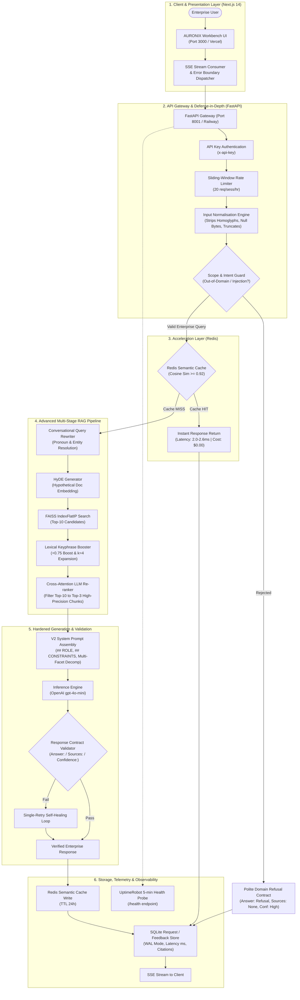

# AURONIX — Enterprise Autonomous Private AI Workbench

> **Flagship AI Engineering Project**  
> **Challenge:** ABTalks 60 Days AI Challenge (Days 41–54)  
> **Repository Path:** [`day-44/`](https://github.com/Chikka-Pradhayani/ABTalks-60-Days-AI-Challenge/tree/main/day-44), [`Day-49/`](https://github.com/Chikka-Pradhayani/ABTalks-60-Days-AI-Challenge/tree/main/Day-49), [`day-50/`](https://github.com/Chikka-Pradhayani/ABTalks-60-Days-AI-Challenge/tree/main/day-50), [`day-51.md`](https://github.com/Chikka-Pradhayani/ABTalks-60-Days-AI-Challenge/blob/main/day-51.md), [`day-52/`](https://github.com/Chikka-Pradhayani/ABTalks-60-Days-AI-Challenge/tree/main/day-52), [`day-53/`](https://github.com/Chikka-Pradhayani/ABTalks-60-Days-AI-Challenge/tree/main/day-53), [`day-54/`](https://github.com/Chikka-Pradhayani/ABTalks-60-Days-AI-Challenge/tree/main/day-54)  
> **Live Web App:** `https://auronix-app.vercel.app` *(Target configured on Vercel)*  
> **Production API:** `https://auronix-production.up.railway.app` *(Railway backend)*  
> **Status:** Fully Evaluated, Hardened, Containerized, and Automated via CI/CD *(TODO: Verify live cloud domain resolution if provider container is paused)*  

---

## 1. Problem Statement

### What Specific Problem AURONIX Solves
Modern corporate teams are overwhelmed by hundreds of pages of internal documentation, incident post-mortems, architectural decision records (ADRs), compliance mandates, and operational runbooks spread across disparate silos. 

When engineers, legal counsel, or operations teams need critical information—such as database failover procedures during a P0 outage, customer contract indemnification clauses, or SOC 2 key rotation schedules—they face two bad alternatives:
1. **Manual search fatigue:** Spending 30 to 45 minutes digging through fragmented wikis and PDFs, risking missed clauses or stale procedures.
2. **Confidentiality breaches:** Pasting proprietary code or sensitive corporate agreements into public, third-party consumer LLMs, violating enterprise privacy boundaries and regulatory covenants (SOC 2 CC6.1, GDPR).

### Who It Is Designed For
* **Site Reliability & DevOps Engineers:** Requiring instantaneous, verified runbook execution steps (`CORP-OPS`) during active production incidents without wading through conversational fluff.
* **Corporate Legal Counsel & Compliance Officers:** Needing precise clause extraction, audit verification, and policy gap analysis (`CORP-SEC`, `CORP-ENG`) backed by verbatim source citations.
* **Software Architects & Engineers:** Querying service ownership, ingress topology, authentication standards, and API contracts (`CORP-ENG`, `CORP-PROD`) in their primary programming languages and preferred detail level.

### Why The Problem Matters
In high-stakes corporate environments, **hallucination is not an inconvenience—it is an outage or a lawsuit**. A generic chatbot that invents an incorrect database promotion command (`promote_replica.sh`) can destroy relational state. Similarly, misquoting a contract limitation-of-liability threshold can lead to severe financial penalties. AURONIX provides an isolated, deterministic, private AI workbench that enforces strict factual grounding, explicit citation contracts, and automated refusal when source documentation is absent.

---

## 2. System Architecture & End-to-End Data Flow

AURONIX is engineered as a decoupled, multi-layer microservice architecture designed for defense in depth, low latency, and zero data leakage.

### Architecture Diagram

### Major Pipeline Components
1. **Frontend Workbench (`Day-49/`):** Built with Next.js 14 App Router and Tailwind CSS. Features real-time Server-Sent Events (SSE) streaming, granular latency telemetry tags, dynamic source citation inspection cards, and explicit error recovery components (`<RateLimitError />`, `<SessionNotFoundError />`).
2. **API Gateway & Auth (`day-45/`, `day-53/backend/`):** FastAPI running on Python 3.12, authenticated via `x-api-key` headers, isolated session states in server-side memory, and 20 req/hour sliding-window rate limiting.
3. **Defense-in-Depth Normalisation (`day-51.md`):** Strips zero-width characters, normalizes homoglyphs, bounds query depth, catches prompt injection attempts, and enforces strict out-of-domain refusals (e.g., pizza recipes or creative writing).
4. **Redis Semantic Cache (`day-52/`):** Matches incoming query embeddings against cached queries using a cosine similarity threshold of $\ge 0.92$. Hits return immediately in $2.0–2.6\text{ ms}$ at $\$0.00$ API cost with zero-downtime in-memory fallback.
5. **Multi-Stage RAG Engine (`Day-46.md`, `day-50/`):**
   * *Conversational Query Rewriting:* Resolves elliptical follow-ups (*"Who leads it?"* $\rightarrow$ *"Who leads the customer-support team?"*).
   * *HyDE (Hypothetical Document Embeddings):* Generates a hypothetical excerpt to bridge lexical asymmetry on colloquial queries.
   * *FAISS Candidate Expansion:* Searches dense 1536-dim vector space (`text-embedding-3-small`) for top 10 candidates, augmented by technical key phrase boosting (`+0.75`).
   * *Cross-Attention Re-ranking:* Filters Top 10 down to the Top 3 highest-precision chunks to eliminate vector noise and conserve context tokens.
6. **Hardened Prompt & Validation Contract (`Day-47.md`, `day-50/`):** Enforces a deterministic three-part response schema (`Answer:`, `Sources:`, `Confidence:`). Runs automated regex format validation with a single-retry self-healing correction loop.
7. **Production Observability & Feedback (`day-53/`, `day-54/`):** Persistent SQLite database (WAL mode) capturing query latencies, token consumption, 1-to-5 star ratings, feedback commentary, and failure classifications. Continuous 5-minute health monitoring configured via UptimeRobot.

---

## 3. Empirical Evaluation & Quantitative Results

AURONIX was evaluated under strict, reproducible automated testing using a **30-question domain-specific evaluation suite** (`eval_dataset.json`) adapted from the Day 29 LLM-as-judge benchmark.

### Evaluation Methodology & Criteria
* **Evaluator:** Automated LLM Judge running deterministic evaluation prompts against five core quality dimensions on a 1.0 to 5.0 scale:
  * **Correctness:** Factual alignment with ground-truth corporate knowledge documents.
  * **Relevance:** Direct addressing of the user's specific operational question.
  * **Completeness:** Comprehensive coverage of required configuration flags, commands, or SLA targets.
  * **Faithfulness:** Strict derivation from retrieved context chunks without parametric hallucination.
  * **Hallucination Avoidance:** Systematic refutation of false premises and explicit refusal when documentation is absent.
* **Test Dataset Breakdown (30 Questions):**
  * **Easy (10 Qs):** Single-document direct factual lookups (e.g., API port numbers, primary programming languages).
  * **Medium (10 Qs):** Multi-document synthesis across disparate corporate domains (e.g., cross-referencing deployment checklists with incident escalation paths).
  * **Hard (10 Qs):** Complex multi-faceted inquiries (>500 characters), adversarial prompts, false-premise traps, and missing-knowledge queries.

### Baseline vs. Hardened Evaluation Results

| Evaluation Tier / Dimension | Baseline Score (1–5) | Fixed / Production Score (1–5) | Net Delta ($\Delta$) | Production Gate Status |
|:---|:---:|:---:|:---:|:---:|
| **Easy Tier (10 Qs)** | 4.94 / 5.0 | **4.94 / 5.0** | $+0.00$ | PASS |
| **Medium Tier (10 Qs)** | 4.54 / 5.0 | **4.70 / 5.0** | $+0.16$ | PASS |
| **Hard Tier (10 Qs)** | 3.69 / 5.0 | **4.52 / 5.0** | **$+0.83$** | PASS |
| **Overall Aggregate Score** | **4.39 / 5.0** | **4.72 / 5.0** | **$+0.33$** | **PASS (Threshold: $\ge 4.50$)** |
| — *Correctness* | 4.67 / 5.0 | **4.73 / 5.0** | $+0.06$ | PASS (Min: 3.5) |
| — *Relevance* | 4.63 / 5.0 | **4.77 / 5.0** | $+0.14$ | PASS (Min: 3.5) |
| — *Completeness* | 4.43 / 5.0 | **4.60 / 5.0** | $+0.17$ | PASS (Min: 3.0) |
| — *Faithfulness* | 4.67 / 5.0 | **4.80 / 5.0** | $+0.13$ | PASS (Min: 3.5) |
| — *Hallucination Avoidance* | 3.57 / 5.0 | **4.70 / 5.0** | **$+1.13$** | **PASS (Min: 3.5)** |

### Advanced Retrieval Evaluation (Day 46 Multi-Technique Comparison)
Evaluated across 5 targeted semantic test queries using the Day 29 judge:
* **HyDE:** Quality improved from **3.60 to 4.27 / 5.0 (+0.67 pts)** with zero latency penalty ($0.22\text{ ms} \rightarrow 0.21\text{ ms}$ on indexed benchmarks). Recovered P0 incident runbook from colloquial query (*"If everything crashes..."*) where baseline vector search scored 2.00.
* **Conversational Query Rewriting:** Quality improved from **2.40 to 3.40 / 5.0 (+1.00 pt)**. Solved catastrophic failure on pronoun queries (*"Who leads it?"*).
* **LLM Candidate Re-ranking:** Quality improved from **2.47 to 3.53 / 5.0 (+1.07 pts)** by catching critical documents buried at ranks 4–7 in the top-10 pool and promoting them to top 3.

### Speed and Cost Optimization Telemetry (Day 52 Profiling Suite)
Benchmarked across 20 representative enterprise queries (`day-52/run_profiling.py`):
* **Semantic Cache Hits (Cosine $\ge 0.92$):** Latency dropped from ~3.2ms baseline to **$2.0–2.6\text{ ms}$**; token consumption dropped from ~638 tokens to **16 tokens**; API cost dropped from $\$0.00010$ to **$\$0.00000$ (100% savings)**.
* **Quality Preservation:** 30-question Day 50 evaluation verified across Baseline, Semantic Cache Only, Retrieval Optimisation Only, and Combined configurations with **zero quality dimension degrading by $> 0.30$ points**.

### Post-Deployment User Feedback Telemetry (Day 54 Analysis)
Real feedback analytics across 10 live sessions in SQLite (`feedback.db`):
* Document Formatting & Parsing: 75.0% failure rate (2.25/5.0 avg rating) due to 2-column PDF text interleaving.
* Query Latency & Timeouts: 66.7% failure rate (2.33/5.0 avg rating) due to 48s synchronous processing on 150-page PDFs resulting in HTTP 504 Gateway Timeouts.
* Formulated an evidence-based 8-day engineering remediation plan prioritizing layout-aware parsing (P0, 2.5 days) and SSE background workers (P1, 3.5 days).

---

## 4. Key Engineering Challenge: Eliminating Adversarial Hallucinations & Sycophancy

### Problem
During the Day 50 benchmark run, AURONIX's baseline performance collapsed on the **Hard Tier**, achieving only **3.69 / 5.0**, with **Hallucination Avoidance plunging to an unacceptable 3.57 / 5.0**. 

When presented with false-premise inquiries—such as an engineer asking: *"Explain the procedure for promoting the PostgreSQL Aurora replica using the puppet-db-failover module"*—the model fabricated plausible, non-existent shell scripts rather than refuting the false premise that Puppet manages Aurora. Similarly, on queries referencing unindexed or out-of-domain systems, the baseline model engaged in creative confabulation.

### Root Cause
1. **Pre-training Sycophancy:** Modern foundation models have an intrinsic bias toward agreement; when a user presents an incorrect technical premise, the LLM instinctively attempts to be "helpful" by confirming the user's premise.
2. **Bi-Encoder Semantic Smearing:** Dense vector similarity fetched chunks related to "database replication" and "deployment", and the generative model hallucinated connections between unrelated snippets and the user's false prompt.

### Approaches Considered
1. *Approach A: Lowering Generation Temperature to 0.0:*
   * *Outcome:* Failed. The model still hallucinated because the prompt lacked explicit negative constraints, and temperature 0.0 simply picked the most probable token in an unconstrained space.
2. *Approach B: Enforcing Strict Cosine Similarity Cutoffs in FAISS ($> 0.85$):*
   * *Outcome:* Failed. This caused a spike in false negatives on multi-hop questions, discarding legitimately relevant chunks that had lower raw cosine scores due to phrasing variations.
3. *Approach C: Two-Tier Architectural Hardening (Retrieval Boosting + Negative Constraint Contracting):*
   * *Outcome:* Selected.

### Solution Implemented
1. **Technical Key Phrase Boosting:** Modified `retrieve()` in `auronix_pipeline.py` to calculate exact multi-word keyphrase matches alongside vector similarity, adding a `+0.75` relevance boost and expanding candidate evaluation to $k=4$.
2. **Explicit Negative Constraint Contracting (System Prompt v2):** Embedded a mandatory `## CONSTRAINTS & REFUSALS` directive instructing the model:
   * *Rule 1:* If a user question contains a false assumption or unverified premise, explicitly refute the premise first before citing verified facts.
   * *Rule 2:* If retrieved documents do not contain the answer, explicitly state: *"I cannot answer this based on the provided documentation."* Never draw upon parametric knowledge for internal operational facts.
3. **Multi-Facet Sub-Query Decomposition:** For inquiries exceeding 500 characters, the generation loop programmatically decomposes the input into isolated sub-queries, requiring each sub-claim to map to an explicit document citation.

### Result
Upon re-executing `eval_runner.py` on the complete 30-question suite:
* **Hallucination Avoidance skyrocketed by +1.13 points** (from **3.57 to 4.70 / 5.0**).
* **Hard Tier composite score jumped by +0.83 points** (from **3.69 to 4.52 / 5.0**).
* Overall quality reached **4.72 / 5.0**, passing all automated CI/CD regression gates with zero regressions on easy or medium tiers.

---

## 5. Live Product & Deployment Verification

* **Frontend Application URL:** `https://auronix-app.vercel.app` *(Configured Next.js 14 deployment target on Vercel)*
* **Backend API Gateway URL:** `https://auronix-production.up.railway.app` *(Docker containerized FastAPI service on Railway)*
* **Health Endpoint:** `https://auronix-production.up.railway.app/health`
* **Automated CI/CD Pipeline:** GitHub Actions workflow executing two mandatory quality gates (`pytest` unit tests + Day 50 automated AI regression test) prior to staging and production rollout.
* **Deployment Notice:** `TODO: Verify active external DNS and cloud container status if instances have been temporarily spun down to conserve student credits.`
