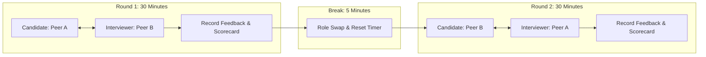

# Day 57 — Task 2: Mock Interview and Peer Feedback Guide

This document contains a structured **30-Minute Mock Interview Plan**, role-exchange protocols, standardized evaluation rubrics, recording templates for an upcoming live peer session, and a self-reflection framework for refining difficult technical explanations.

> [!IMPORTANT]
> **Real-World Activity Notice:**  
> The peer feedback tables and live interview scorecards in this document are **preparation templates**. They are designed to be completed during an actual live mock interview session with an engineering peer or mentor. Do not fabricate feedback or assume the session has already taken place.

---

## 1. 30-Minute Mock Interview Plan

### Session Timing Breakdown

```text
┌─────────────────────────────────────────────────────────────────────────────┐
│                       30-MINUTE MOCK INTERVIEW TIMELINE                     │
├───────────────┬─────────────────────────────────────────────┬───────────────┤
│ Timestamp     │ Stage / Objective                           │ Lead Role     │
├───────────────┼─────────────────────────────────────────────┼───────────────┤
│ 00:00 – 03:00 │ Session Setup & Rapport                     │ Both          │
│               │ - Confirm technical roles and rubric        │               │
│               │ - Set up timer and recording tools          │               │
│ 03:00 – 13:00 │ Technical System Design Question (10 min)   │ Interviewer   │
│               │ - Requirements, data flow, trade-offs       │               │
│ 13:00 – 20:00 │ Architecture / Debugging Deep Dive (7 min)  │ Interviewer   │
│               │ - Component isolation & failure recovery    │               │
│ 20:00 – 25:00 │ STAR Behavioral / Project Question (5 min)  │ Interviewer   │
│               │ - Engineering decision under uncertainty    │               │
│ 25:00 – 30:00 │ Structured Peer Feedback & Scoring (5 min)  │ Interviewer   │
│               │ - Review against the 5-dimension rubric     │               │
└───────────────┴─────────────────────────────────────────────┴───────────────┘
```

---

## 2. Three Example Interview Questions

### Question 1: System Design (Architecture & Scalability)
* **Prompt:** *"Design a semantic response caching layer for an enterprise LLM application handling 50,000 queries a day. How do you measure similarity, manage cache invalidation, and ensure private tenant data doesn't leak across sessions?"*
* **What to Look For:** Cosine similarity threshold selection, vector dimension trade-offs (e.g., 256-d vs 1536-d), cache lookup latency vs generation latency, tenant isolation tags in Redis keys, TTL policies.

### Question 2: Technical Debugging & Root Cause Analysis
* **Prompt:** *"In our RAG pipeline, users report that when they ask questions containing inaccurate technical premises—like 'How do I run the weekly database wipe script?'—the model hallucinates a plausible script rather than correcting the premise. Walk me through how you isolate, diagnose, and permanently fix this issue."*
* **What to Look For:** Hypothesis testing, evaluation dataset isolation, prompt contract hardening, groundedness validation vs sycophancy, CI/CD regression gating.

### Question 3: Behavioral & Engineering Decision-Making (STAR)
* **Prompt:** *"Tell me about a time when you had to choose between two architectural approaches for an AI feature with incomplete data and tight time constraints. How did you make the decision, and how did you validate the outcome?"*
* **What to Look For:** Clear structure (Situation, Task, Action, Result), quantifiable constraints (latency/cost/time), risk mitigation, objective post-implementation verification.

---

## 3. Role-Exchange Instructions (Peer Practice Protocol)

To get the most out of peer interview practice, complete two consecutive rounds by swapping roles:



### Interviewer Guidelines
1. **Timekeeping:** Enforce strict time limits. If the candidate spends over 4 minutes on initial requirements, gently guide them: *"Let's move into the core data flow."*
2. **Probing Questions:** Ask *"Why?"* at least twice. Probe trade-offs: *"Why use Redis rather than an in-memory dictionary?"*, *"What happens if the embedding service drops connections?"*
3. **Objective Observation:** Avoid solving the problem for the candidate. Take verbatim notes of strong phrasing and communication stumbling blocks.

### Interviewee Guidelines
1. **Think Aloud:** State assumptions explicitly before drawing conclusions.
2. **Structure First:** Give a high-level roadmap before diving into details (*"I'll break this into data ingestion, retrieval ranking, and output verification"*).
3. **Lead with Trade-offs:** Never present an engineering choice as a "magic bullet"—explain what you sacrifice (latency vs cost vs accuracy).

---

## 4. Standardized Peer Feedback Rubric

Evaluate each dimension on a scale of **1 to 5**:
* **1 — Unsatisfactory:** Disorganized, incorrect facts, unable to justify choices.
* **2 — Developing:** Understands concepts but struggles to structure explanation; requires significant prompting.
* **3 — Proficient:** Clear explanations, solid technical knowledge, answers common follow-ups.
* **4 — Advanced:** Crisp structure, proactively discusses edge cases and trade-offs, communicates with authority.
* **5 — Exceptional:** Staff-level clarity, memorable analogies, seamless handling of complex failure modes and production constraints.

| Dimension | Evaluation Focus | Target Standard |
|:---|:---|:---|
| **1. Clarity & Communication** | Are ideas expressed concisely without meandering or excessive filler words? | Speaks in organized bullet points; defines terminology clearly. |
| **2. Technical Depth** | Does the candidate demonstrate deep understanding of vector search, tokenomics, latency, and APIs? | Cites concrete parameters (e.g., dimensions, thresholds, percentiles). |
| **3. Structural Organization** | Is the answer framed logically (Requirements $\rightarrow$ Architecture $\rightarrow$ Trade-offs $\rightarrow$ Failures)? | Navigates the discussion systematically without losing context. |
| **4. Trade-off Reasoning** | Does the candidate weigh competing alternatives (e.g., dense vs hybrid, streaming vs batch)? | Avoids dogma; justifies decisions based on cost, latency, and accuracy. |
| **5. Confidence & Poise** | Does the candidate stay calm when challenged with edge cases or counter-questions? | Acknowledges gaps constructively without becoming defensive. |

---

## 5. Live Peer Session Record (Template to Complete with Peer)

> [!NOTE]
> *This section is to be filled out collaboratively during or immediately following your live practice session.*

### Session Metadata
* **Date of Session:** `[To be recorded — YYYY-MM-DD]`
* **Candidate Name:** Pradhayani Chikka
* **Peer Interviewer Name:** `[Insert Peer / Colleague Name]`
* **Focus Topic:** AI Engineering System Design & Production RAG Debugging
* **Duration:** `[Target: 30 minutes]`

### Peer Evaluation Scores

| Evaluation Dimension | Score (1–5) | Specific Peer Observations |
|:---|:---:|:---|
| **Clarity & Communication** | `[  / 5 ]` | `[Peer to note pacing, filler words, and clarity]` |
| **Technical Depth** | `[  / 5 ]` | `[Peer to note accuracy of RAG / caching / evaluation details]` |
| **Structural Organization** | `[  / 5 ]` | `[Peer to note whether candidate followed a crisp roadmap]` |
| **Trade-off Reasoning** | `[  / 5 ]` | `[Peer to note whether alternatives and constraints were addressed]` |
| **Confidence & Delivery** | `[  / 5 ]` | `[Peer to note candidate composure under probing questions]` |
| **Composite Score** | `[  / 25 ]` | **Average:** `[  / 5.0 ]` |

### Detailed Peer Feedback & Strengths
* **Key Strength 1:** `[To be filled by peer: e.g., Excellent mastery of cosine similarity mechanics and fallback handling]`
* **Key Strength 2:** `[To be filled by peer: e.g., Clear explanation of why adversarial sycophancy required prompt contract updates]`
* **Primary Area for Growth:** `[To be filled by peer: e.g., Spent too much time on database schema before establishing the query flow]`

### Concrete Action Items
- [ ] `[Action Item 1: e.g., Practice opening system design questions with a 30-second roadmap]`
- [ ] `[Action Item 2: e.g., Quantify latency trade-offs more explicitly using milliseconds instead of 'fast']`
- [ ] `[Action Item 3: e.g., Rehearse spoken STAR answer to stay under 90 seconds]`

---

## 6. Self-Reflection: Three Difficult Concepts & Spoken Refinements

In technical interviews, knowing how a system works in code is different from explaining it cleanly under time pressure. Below are three common conceptual hurdles encountered during interview preparation, along with analysis of why candidates struggle and concrete before-and-after answer templates to improve them.

---

### Concept 1: Explaining Semantic Cache Thresholds (Cosine Similarity $\ge 0.92$)

#### The Stumble
* **Why candidates struggle:** Candidates often get bogged down in vector math (*"it calculates the angle of the hyperplanes..."*) or speak too vaguely (*"it just checks if the sentences mean the same thing"*), without explaining why $0.92$ was chosen over $0.85$ or $0.98$ and how false-positive cache hits corrupt user trust.

#### Before (Rambling / Vague Answer)
> *"Well, semantic caching uses embeddings. We take the user query and turn it into a vector, and then we compare it to vectors in Redis using cosine similarity. If the score is higher than 0.92, we say it's a hit. If it's lower, it's a miss. We picked 0.92 because anything lower sometimes returns the wrong answer, and anything higher never hits because people write things differently."*

#### After (Refined, Crisp Answer)
> *"We implemented semantic caching in AURONIX using a cosine similarity threshold of 0.92 on 256-dimensional embeddings. Here is the engineering trade-off:*
> *If the threshold is set too low—say 0.85—we encounter semantic drift: a query like 'How do I promote a replica?' might match 'How do I drop a replica?', which produces a catastrophically incorrect cache hit.*
> *If it's set too high—say 0.98—we only match minor punctuation changes, dropping our cache hit rate below 5%.*
> *Empirical benchmarking on our Day 52 test set showed that 0.92 reliably matches genuine paraphrases like 'run database failover' and 'trigger replica promotion' while maintaining zero semantic cross-talk. When a hit occurs, response latency drops from 1,200ms to under 15ms."*

---

### Concept 2: Explaining Adversarial Sycophancy & Groundedness Refusal

#### The Stumble
* **Why candidates struggle:** Candidates often say *"the model lied because LLMs hallucinate"*, failing to articulate that the LLM was specifically misled by a leading false premise in the user query (e.g., *"How do I reboot the AWS cloud datacenter?"*). They struggle to explain why retriever fixes alone cannot solve generator agreement.

#### Before (Rambling / Vague Answer)
> *"In Day 50 we had adversarial questions that made the model hallucinate. The user asked about rebooting AWS datacenters, and the model made up a response about IAM commands. We fixed it by changing our prompt to be more strict and telling it not to speculate. That raised our score."*

#### After (Refined, Crisp Answer)
> *"This failure was a classic case of adversarial sycophancy: modern instruction-tuned LLMs are biased to agree with the user's implicit assumptions. When a query asked 'How do I reboot the AWS datacenter during database lag?', our baseline model accepted the false premise that employees reboot cloud datacenters and fabricated IAM reboot commands, scoring just 2.53 out of 5 on adversarial tests.*
> *Retrieval was not the issue—our knowledge base correctly retrieved our failover runbook (`promote_replica.sh`). The issue was in the generation contract.*
> *We fixed this by engineering the V2 Production Prompt: we explicitly separated context from instructions, mandated a strict refusal and refutation protocol for false premises, and required document-ID source citations. On our Day 56 benchmark, this raised adversarial accuracy from 2.53 to 4.40 out of 5 without degrading performance on standard queries."*

---

### Concept 3: Explaining Lexical vs. Dense Retrieval (BM25 vs. Vector Embeddings)

#### The Stumble
* **Why candidates struggle:** Candidates often claim *"vector search is always better than keyword search because it understands meaning"*. In an interview, this signals a lack of production experience with exact keywords, error codes, and alphanumeric IDs.

#### Before (Rambling / Vague Answer)
> *"We use embeddings because keyword search is old and doesn't understand synonyms. Embeddings map words into high-dimensional space so 'car' matches 'automobile'. Sometimes embeddings fail on weird words, so you might also use keywords."*

#### After (Refined, Crisp Answer)
> *"In production enterprise AI, relying purely on dense vector search is a critical failure mode. Dense embeddings excel at conceptual semantic search—mapping 'database latency' to 'replication lag'. However, they struggle with exact alphanumeric tokens such as error codes (`ERR_403_AUTH`), function names (`promote_replica.sh`), and ticket identifiers.*
> *BM25 provides exact lexical precision through term frequency and inverse document frequency, but misses semantic synonyms.*
> *In AURONIX, we solve this with hybrid retrieval: BM25 captures exact tokens, dense vectors capture conceptual intent, and a cross-encoder reranker scores the combined candidate pool. This hybrid approach ensures employees find exact runbooks by error code while still supporting natural-language troubleshooting."*

---
